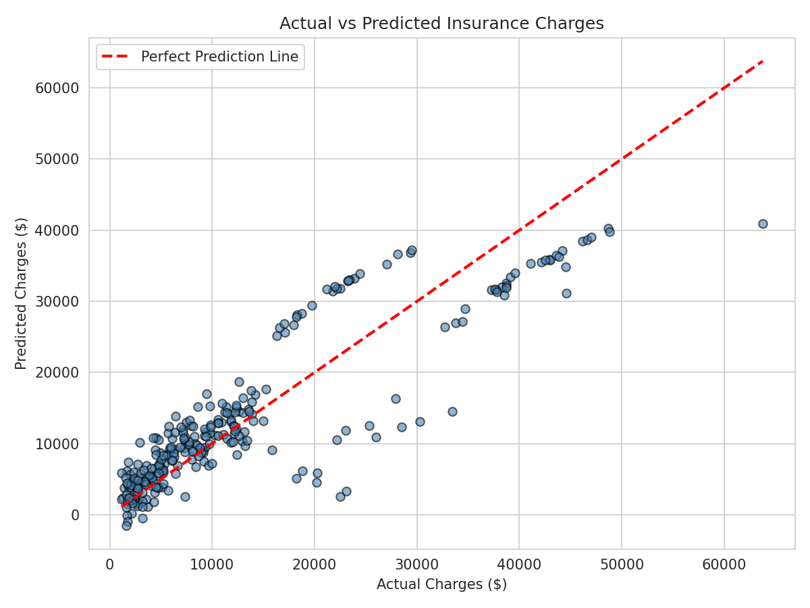
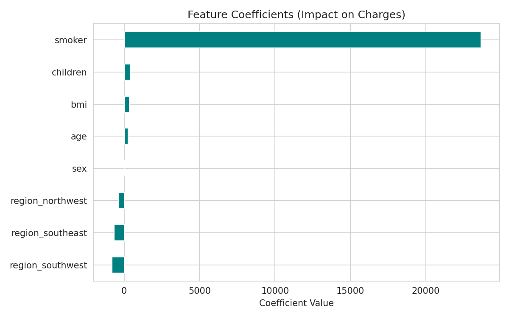

# Medical Insurance Cost Prediction using Multiple Linear Regression

## 👤 Student Details
| Field | Value |
|-------|-------|
| Name | AADISH ADLAK |
| Registration Number | 23BCE10681 |
| Application Number | IN26010985 |
| Batch Number | 9A |
| Assignment Number | Assignment - 1 |
| Email Address | adlakaadish@gmail.com |
| Public GitHub Repository Link | https://github.com/AADISHADLAK/MPONLINE-Assignment-1 |

## 📌 Objective
The goal of this project is to help an insurance company estimate a customer's **medical insurance charges** based on their personal and health-related attributes (age, sex, BMI, number of children, smoking status, and region). A **Multiple Linear Regression** model is built, trained, and evaluated to make this prediction.

## 📊 Dataset
**Medical Cost Personal Insurance Dataset**
Source: [Kaggle — mirichoi0218/insurance](https://www.kaggle.com/datasets/mirichoi0218/insurance)

The dataset contains 1,338 records with the following columns:

| Column     | Type        | Description                                  |
|------------|-------------|-----------------------------------------------|
| age        | Numerical   | Age of the primary beneficiary                |
| sex        | Categorical | Gender (male / female)                        |
| bmi        | Numerical   | Body Mass Index                               |
| children   | Numerical   | Number of dependents covered by insurance     |
| smoker     | Categorical | Smoking status (yes / no)                     |
| region     | Categorical | Residential area (northeast, northwest, southeast, southwest) |
| charges    | Numerical (Target) | Individual medical costs billed by insurance |

> **Note:** The raw dataset is *not* included in this repository per assignment instructions. Download it directly from the Kaggle link above, or use any equivalent public mirror, and place it as `insurance.csv` in the project root before running the notebook.

## 🛠️ Libraries Used
- `pandas` — data loading & manipulation
- `numpy` — numerical operations
- `matplotlib` & `seaborn` — data visualization
- `scikit-learn` — model building (`LinearRegression`) and evaluation (`train_test_split`, `mean_absolute_error`, `mean_squared_error`, `r2_score`)

Install everything with:
```bash
pip install pandas numpy matplotlib seaborn scikit-learn jupyter
```

## 🧭 Methodology

1. **Data Understanding**
   - Loaded `insurance.csv` using Pandas and inspected the first five records, shape, and data types.
   - Identified numerical features (`age`, `bmi`, `children`), categorical features (`sex`, `smoker`, `region`), and the target variable (`charges`).

2. **Data Preprocessing**
   - Checked for missing values (none were found in this dataset).
   - Encoded categorical variables:
     - `sex` and `smoker` → binary label encoding (0/1)
     - `region` → one-hot encoding (`pd.get_dummies`, with `drop_first=True` to avoid the dummy variable trap)
   - Split the data into **80% training** and **20% testing** sets using `train_test_split` (`random_state=42` for reproducibility).

3. **Model Development**
   - Trained a `LinearRegression` model from scikit-learn on the training set using all six features (`age`, `sex`, `bmi`, `children`, `smoker`, and the region dummy variables) to predict `charges`.
   - Generated predictions on the held-out test set.

4. **Model Evaluation**
   - Evaluated performance using **MAE**, **MSE**, and **R² Score**.
   - Visualized results with an **Actual vs Predicted** scatter plot and a **feature coefficient** bar chart.

5. **Conclusion**
   - Summarized key findings, the main factors affecting insurance charges, and a limitation of using Linear Regression for this problem.

## 📈 Results

| Metric | Value |
|--------|-------|
| Mean Absolute Error (MAE) | ≈ 4,181.19 |
| Mean Squared Error (MSE)  | ≈ 33,596,915.85 |
| R² Score                  | ≈ 0.7836 |

**Top model coefficients (impact on predicted charges):**

| Feature | Coefficient |
|---------|-------------|
| smoker | +23,651.13 |
| children | +425.28 |
| bmi | +337.09 |
| age | +256.98 |
| sex | +18.59 |
| region_northwest | −370.68 |
| region_southeast | −657.86 |
| region_southwest | −809.80 |

**Actual vs Predicted Charges:**



**Feature Coefficients:**



### Observations
1. **Smoking status is the dominant predictor** — its coefficient (~23,651) is far larger than any other feature, meaning smokers are predicted to pay tens of thousands of dollars more than non-smokers, all else equal.
2. **Age and BMI both increase predicted charges**, consistent with higher medical risk associated with older age and higher BMI.
3. **The model explains ~78% of the variance in charges (R² ≈ 0.78)**, a reasonably strong fit, though it under-predicts for some high-cost outliers — likely smokers with additional compounding risk factors that a purely linear/additive model can't capture.

## ✅ Conclusion

This project used Multiple Linear Regression to predict medical insurance charges from six features: age, sex, BMI, number of children, smoking status, and region. After encoding categorical variables and splitting the data 80/20, the trained model achieved an R² score of approximately 0.78 on the test set, meaning it explains about 78% of the variability in insurance charges. The most important finding is that **smoking status** is by far the strongest driver of higher charges, followed by **age** and **BMI**, while **sex** and **region** have comparatively minor effects. These results align with real-world medical risk factors, where smoking and obesity are well-known contributors to higher healthcare costs.

A key limitation of Linear Regression here is its assumption of a **linear, additive relationship** between features and the target. In reality, factors like smoking and BMI likely interact (a smoker with high BMI may incur disproportionately higher costs than the sum of each factor's individual effect), and charges may grow non-linearly with age. Because plain linear regression cannot capture these interactions or non-linear patterns, it under-predicts costs for some high-risk individuals. Techniques such as polynomial regression, interaction terms, or ensemble methods (e.g., Random Forest, Gradient Boosting) could likely improve predictive accuracy.

## 📁 Repository Structure
```
├── Assignment-1.ipynb          # Jupyter notebook with full analysis (all tasks)
├── analysis.py                 # Equivalent standalone Python script
├── actual_vs_predicted.png     # Actual vs Predicted scatter plot
├── feature_coefficients.png    # Feature coefficient bar chart
└── README.md                   # Project documentation (this file)
```

## ▶️ How to Run
1. Download `insurance.csv` from the [Kaggle dataset link](https://www.kaggle.com/datasets/mirichoi0218/insurance) and place it in the project root.
2. Install dependencies: `pip install pandas numpy matplotlib seaborn scikit-learn jupyter`
3. Run the notebook: `jupyter notebook Assignment-1.ipynb`, or run the script directly: `python analysis.py`
